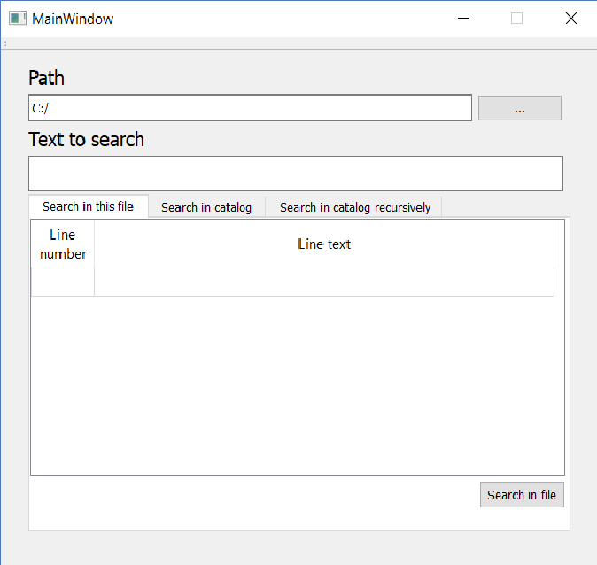
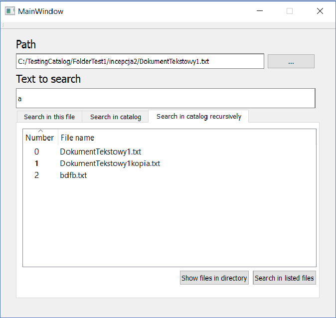
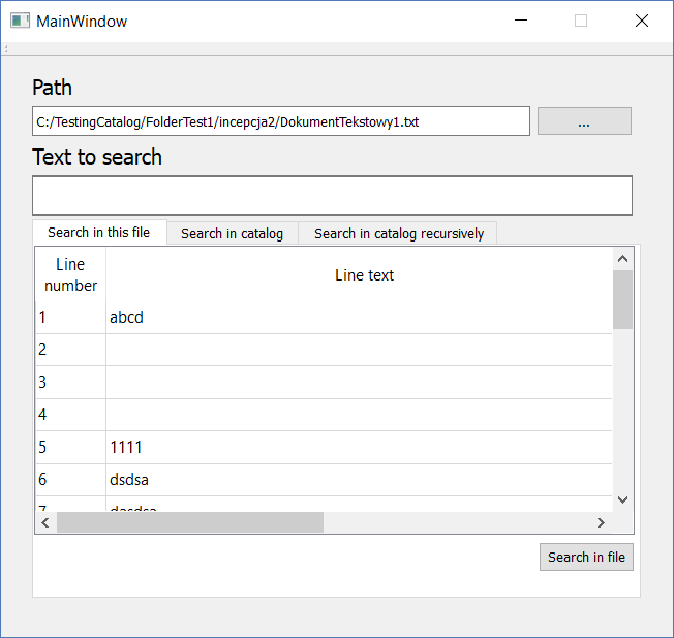
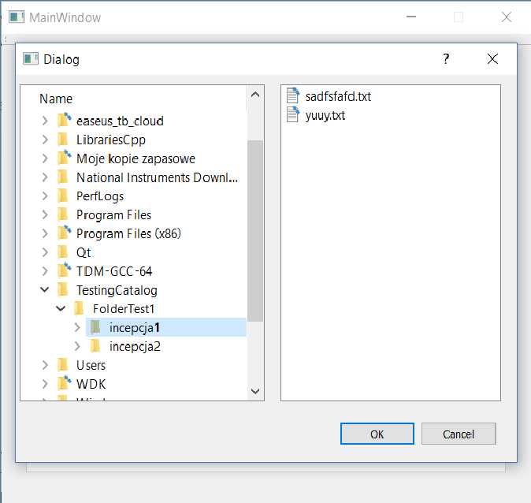
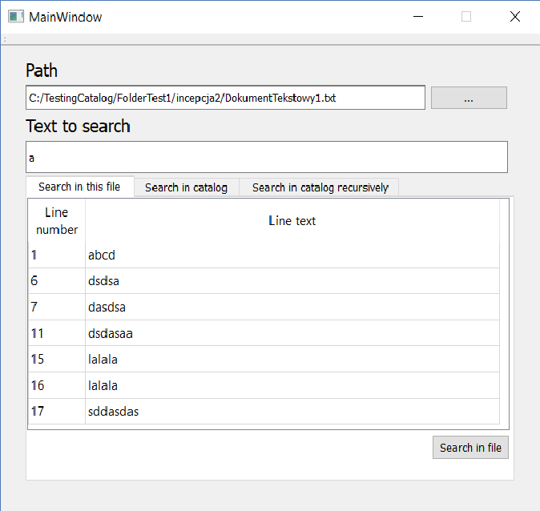
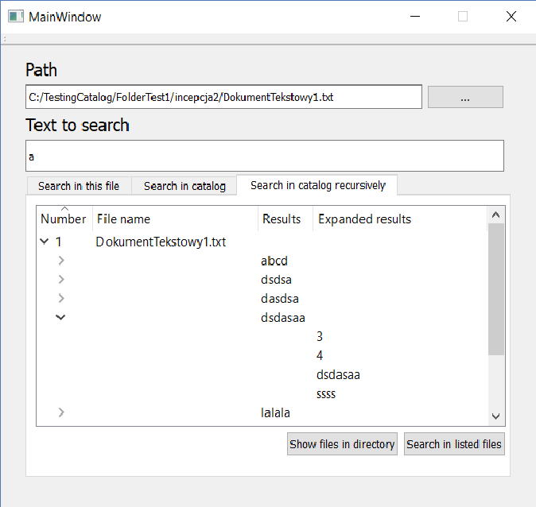
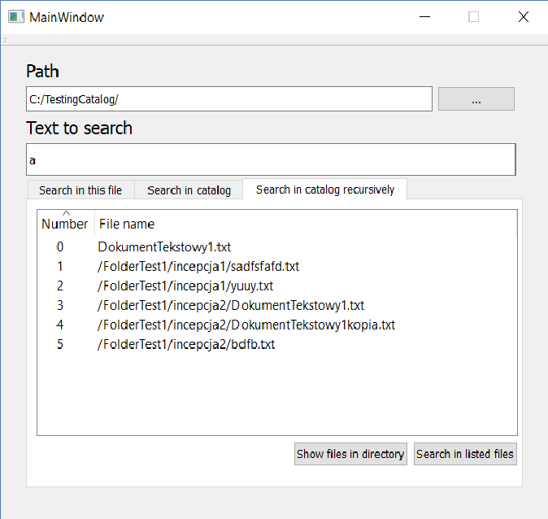

# Graphic Representation Expression Search (GRES)

GRES is graphical user interfaces software for searching plain-text data sets for lines that match an defined expression. It is based on the grep utility.

# How to build 
**Requirements:**

Qt 4.8 framework or later 

(evailable here https://www.qt.io/download-qt-installer?hsCtaTracking=9f6a2170-a938-42df-a8e2-a9f0b1d6cdce%7C6cb0de4f-9bb5-4778-ab02-bfb62735f3e5)

**To build:**

From command line go to path where you want to bild
	qmake officeHelp/officeHelp.pro -r
	make

# How to use
** write path or search using button “….”

** write text to search

** chose to search in file, in catalog or in catalog recursively

** and search !

# Some screenshots of the application: 

# Versioning

1.0.0 Initial version

# Authors

Michal Huras

Tomasz Pienta
 
Adam Wojdylo

# License

European Union Public License 1.2
[More about licences here: https://choosealicense.com/appendix/]

